# CSS-Positions Practise

<a href="https://www.youtube.com/watch?v=bVa2NcYX9DE" target="_blank"> Case 01 Sample Video </a>

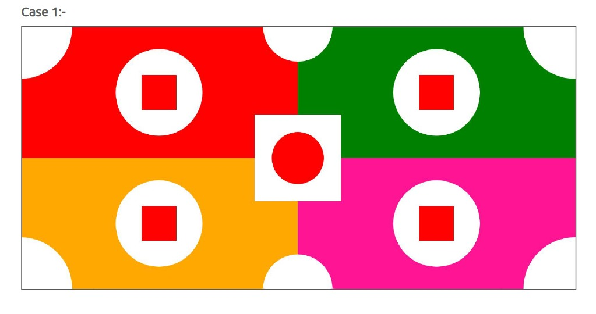

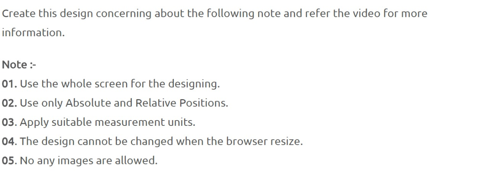

<a href="https://www.youtube.com/watch?v=drlPgs67aXI" target="_blank"> Case 02 Sample Video </a>

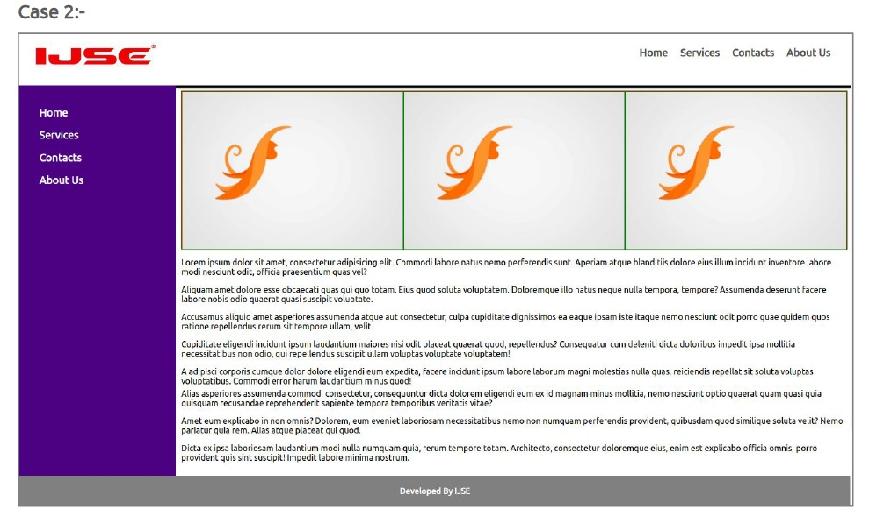

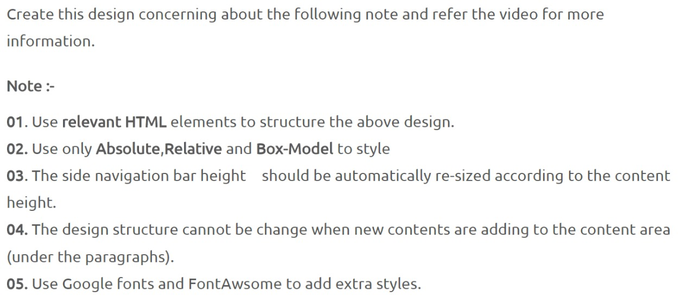

<a href="https://www.youtube.com/watch?v=qp322mFSI9c" target="_blank"> Case 03 Sample Video </a>

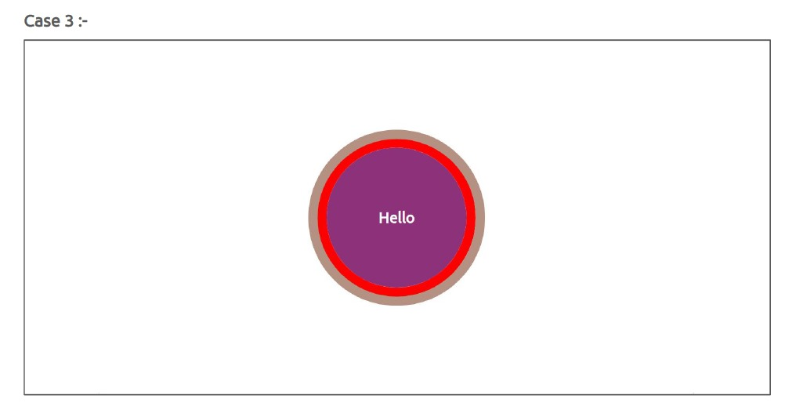

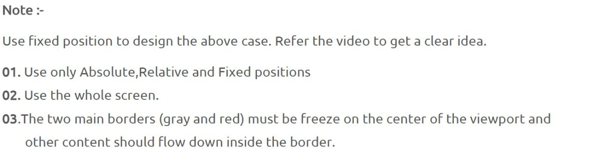

<a href="https://www.youtube.com/watch?v=XnglcYJknxc" target="_blank"> Case 04 Sample Video </a>

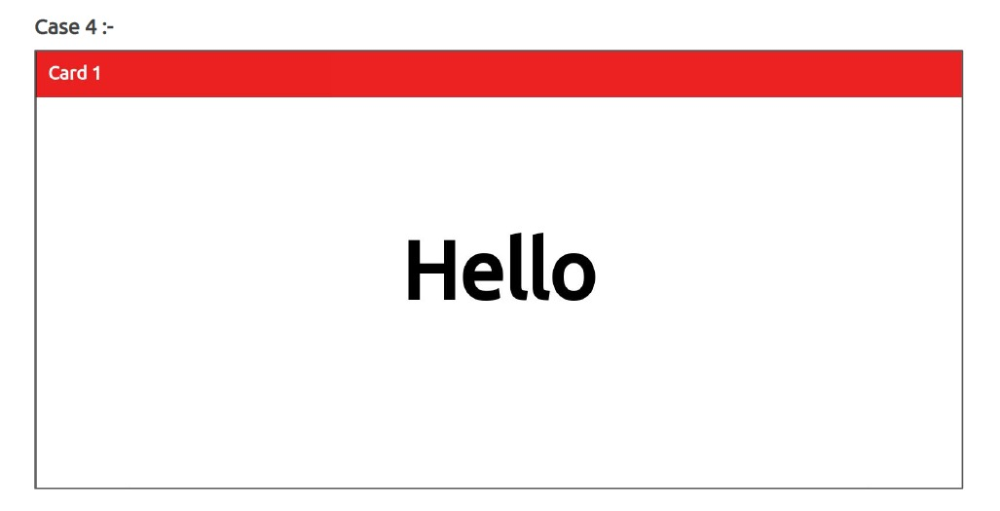

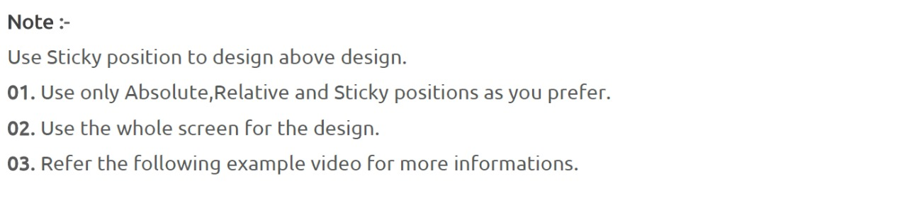

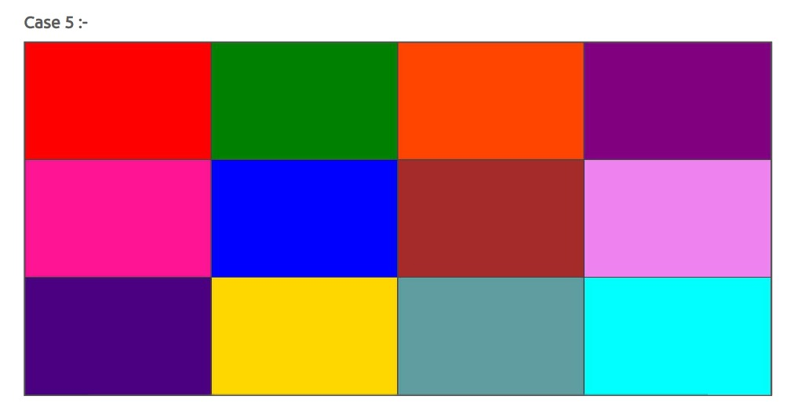

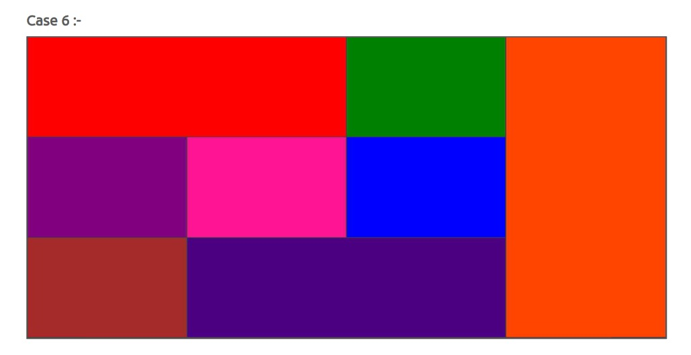

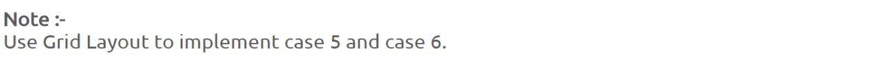

